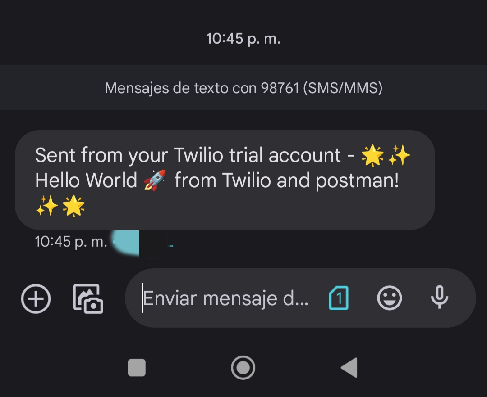
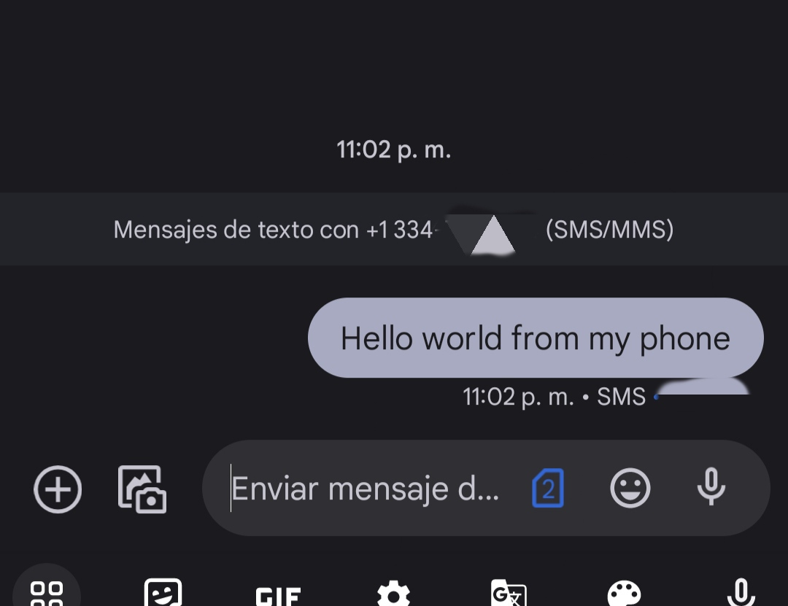
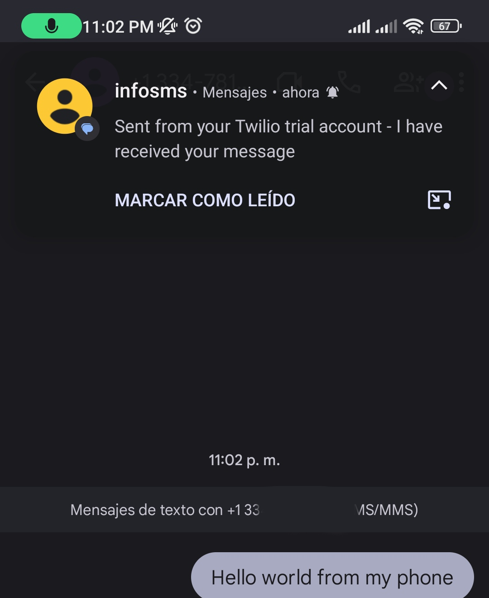

# Twilio Messaging API

Este proyecto es una API construida con Node.js y Express que utiliza Twilio para enviar mensajes de texto y responder automáticamente a los mensajes recibidos.

## Instalación

Para ejecutar este proyecto en tu máquina local, sigue estos pasos:

1. Clona este repositorio en tu máquina local.
2. Ejecuta `npm install` para instalar las dependencias.
3. renombrar el `.env.example` a `.env`
4. Configura las variables de entorno necesarias:

   - `ACCOUNT_SID`: El ID de cuenta de Twilio.
   - `AUTH_TOKEN`: El token de autenticación de Twilio.
   - `TWILIO_NUMBER`: El número de Twilio.

5. Inicia la aplicación con el comando `npm start`.

## Uso

Esta API ofrece dos rutas principales:

# 1-Enviar un mensaje

- **Ruta:** `POST /send`
- **Descripción:** Envía un mensaje de texto a un número de teléfono especificado.
- **Parámetros de entrada:**
  - `countryCode` (Código de país): El código de país del número de teléfono.
  - `number` (Número de teléfono): El número de teléfono de destino.
  - `message` (Mensaje): El mensaje de texto que deseas enviar.
- **Ejemplo de solicitud:**

```json
{
  "countryCode": "52",
  "number": "0000000000",
  "message": "Hola, esto es un mensaje de prueba."
}
```
- **Ejemplo de respuesta:**

```json
{
  "message": "El mensaje se envió correctamente."
}
```


---

# 2- Responde automáticamente/envía un mensaje de confirmación.

- **Ruta:** `POST /sms`
- **Descripción:** Responde automáticamente con un mensaje cuando alguien envía un mensaje a la API
- **Ejemplo de solicitud:**



---

- **Ejemplo de respuesta:**




